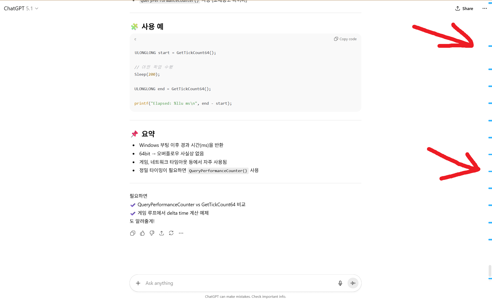
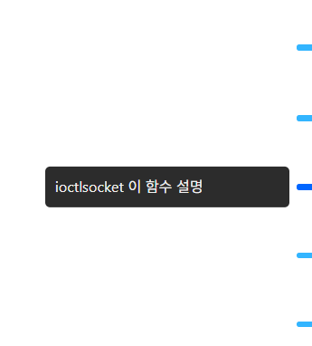
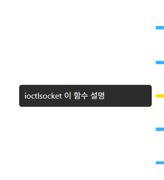
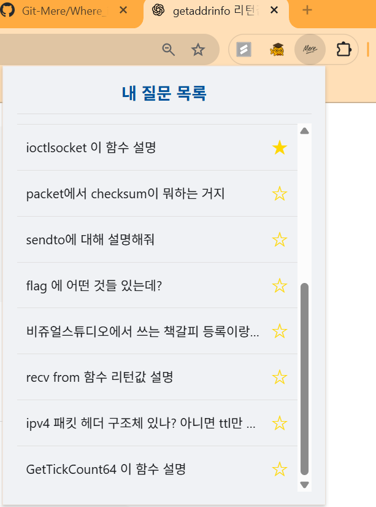

# Where is the Question? - 내 질문 어디 갔지?

GPT와 같은 긴 대화 페이지에서 내가 했던 질문을 쉽게 찾고 관리할 수 있도록 도와주는 브라우저 확장 프로그램입니다.

## 🤔 배경

ChatGPT와 같은 AI 챗봇을 사용하다 보면 대화가 길어지면서 이전에 했던 질문을 다시 확인하기 위해 한참을 스크롤해야 하는 불편함이 있습니다. 중요한 질문을 놓치거나 대화의 흐름을 잃기 쉽습니다.

`Where is the Question?`은 이러한 불편함을 해결하고, 사용자가 자신의 질문에 더 쉽게 접근하고 관리할 수 있도록 돕기 위해 만들어졌습니다.

## ✨ 주요 기능

- **질문 위치 자동 표시**: 페이지에서 질문을 할 때마다 오른쪽 스크롤바 옆에 파란색 마커가 생성되어 질문 위치를 시각적으로 알려줍니다.
- **질문 내용 미리보기**: 파란색 마커에 마우스를 올리면 해당 질문의 내용이 툴팁으로 표시됩니다.
- **클릭하여 질문으로 이동**: 마커를 클릭하면 해당 질문이 있던 위치로 페이지가 자동으로 스크롤됩니다.
- **즐겨찾기 기능**: 중요한 질문이 표시된 마커를 마우스 오른쪽 버튼으로 클릭하여 노란색으로 바꾸고, 즐겨찾기로 등록할 수 있습니다.
- **팝업을 통한 관리**: 확장 프로그램 팝업창을 열어 전체 질문 목록과 즐겨찾기 목록을 확인하고, 원하는 질문으로 바로 이동할 수 있습니다.

## 📸 스크린샷
1.  **기본 기능**: 스크롤바에 질문 마커들이 생성된 모습
    

2.  **질문 미리보기**: 마커에 마우스를 올렸을 때 질문 내용이 보이는 모습
    

3.  **즐겨찾기**: 마커를 우클릭하여 노란색 즐겨찾기로 등록한 모습
    

4.  **팝업 화면**: 확장 프로그램 팝업에서 질문 목록을 관리하는 모습
    

## 🚀 설치 방법

1.  이 저장소를 로컬 컴퓨터에 다운로드하거나 클론합니다.
2.  Chrome 브라우저를 열고 주소창에 `chrome://extensions`를 입력하여 확장 프로그램 관리 페이지로 이동합니다.
3.  오른쪽 상단의 '개발자 모드(Developer mode)'를 활성화합니다.
4.  '압축해제된 확장 프로그램을 로드합니다(Load unpacked)' 버튼을 클릭합니다.
5.  다운로드한 프로젝트 폴더를 선택합니다.

## 💡 사용 방법

확장 프로그램이 설치되면 ChatGPT와 같은 지원 페이지에 접속하세요. 질문을 할 때마다 스크롤바에 마커가 자동으로 생성됩니다.

- **이동**: 마커를 클릭하여 해당 질문 위치로 이동합니다.
- **미리보기**: 마커 위에 마우스를 올려 질문 내용을 확인합니다.
- **즐겨찾기**: 마커를 마우스 오른쪽 버튼으로 클릭하여 즐겨찾기를 등록하거나 해제합니다.

## 🛠️ 개발 과정

이 프로젝트는 오직 Gemini와 ChatGPT를 이용한 바이브 코딩으로 만들어졌습니다.

## 📄 라이선스

이 프로젝트는 [LICENSE](./LICENSE) 파일에 명시된 라이선스를 따릅니다.
