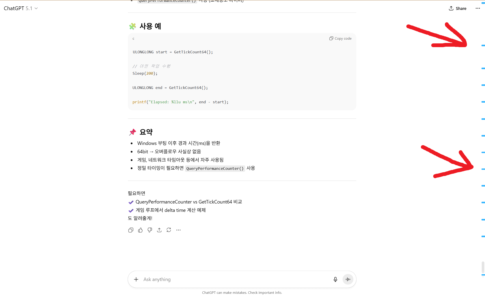
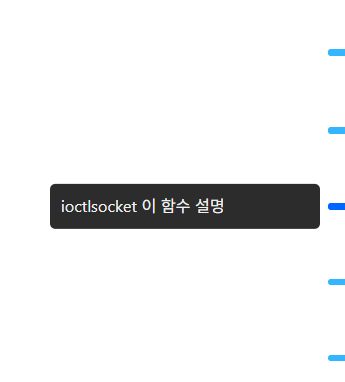
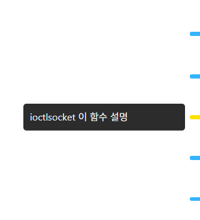
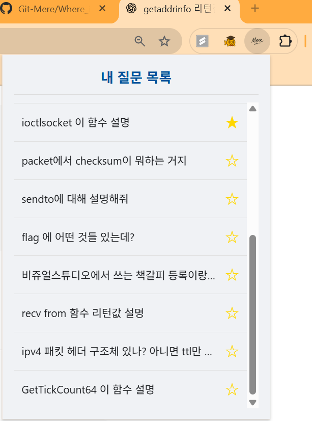

# Where is the Question? - 내 질문 어디 갔지?

## 🚀 Installation / 설치 방법

[Download from Chrome Web Store](https://chromewebstore.google.com/detail/where-is-the-question/gnidmiclaanakeggddihdkepihmpkpff?hl=ko&utm_source=ext_sidebar)

Chrome 웹 스토어에서 확장 프로그램을 다운로드하여 설치하세요.

---

## 🤔 Background / 배경

**English:** When using AI chatbots like ChatGPT, conversations can become very long, making it inconvenient to find previously asked questions. It's easy to lose track of important questions or the flow of conversation. `Where is the Question?` was created to solve this inconvenience, helping users easily access and manage their questions.

**Korean:** ChatGPT와 같은 AI 챗봇을 사용하다 보면 대화가 길어지면서 이전에 했던 질문을 다시 확인하기 위해 한참을 스크롤해야 하는 불편함이 있습니다. 중요한 질문을 놓치거나 대화의 흐름을 잃기 쉽습니다. `Where is the Question?`은 이러한 불편함을 해결하고, 사용자가 자신의 질문에 더 쉽게 접근하고 관리할 수 있도록 돕기 위해 만들어졌습니다.

---

## ✨ Key Features / 주요 기능

*   **Automatic Question Marker**: As you ask questions on the page, blue markers are automatically generated next to the scrollbar, visually indicating the position of your questions.
    *   **질문 위치 자동 표시**: 페이지에서 질문을 할 때마다 오른쪽 스크롤바 옆에 파란색 마커가 생성되어 질문 위치를 시각적으로 알려줍니다.
*   **Question Content Preview**: Hover over a blue marker to see a tooltip displaying the content of that question.
    *   **질문 내용 미리보기**: 파란색 마커에 마우스를 올리면 해당 질문의 내용이 툴팁으로 표시됩니다.
*   **Click to Navigate**: Click a marker to automatically scroll the page to the position where that question was asked.
    *   **클릭하여 질문으로 이동**: 마커를 클릭하면 해당 질문이 있던 위치로 페이지가 자동으로 스크롤됩니다.
*   **Favorites Feature**: Right-click on a question marker to mark it as a favorite (it will turn yellow).
    *   **즐겨찾기 기능**: 중요한 질문이 표시된 마커를 마우스 오른쪽 버튼으로 클릭하여 노란색으로 바꾸고, 즐겨찾기로 등록할 수 있습니다.
*   **Management via Popup**: Open the extension's popup window to view a list of all questions and favorite questions, and navigate directly to any desired question.
    *   **팝업을 통한 관리**: 확장 프로그램 팝업창을 열어 전체 질문 목록과 즐겨찾기 목록을 확인하고, 원하는 질문으로 바로 이동할 수 있습니다.

---

## 📸 Screenshots / 스크린샷

1.  **Basic Functionality**: Scrollbar with question markers generated.  
    **기본 기능**: 스크롤바에 질문 마커들이 생성된 모습
    

2.  **Question Preview**: Question content displayed when hovering over a marker.  
    **질문 미리보기**: 마커에 마우스를 올렸을 때 질문 내용이 보이는 모습
    

3.  **Favorites**: A marker marked as a yellow favorite by right-clicking.  
    **즐겨찾기**: 마커를 우클릭하여 노란색 즐겨찾기로 등록한 모습
    

4.  **Popup View**: Managing the list of questions in the extension popup.  
    **팝업 화면**: 확장 프로그램 팝업에서 질문 목록을 관리하는 모습
    

---

## 💡 How to Use / 사용 방법

**English:** Once the extension is installed, access a supported page: ChatGPT, Gemini, Claude, or Grok. Markers will be automatically generated on the scrollbar as you ask questions.

*   **Navigate**: Click a marker to go to the question's location.
*   **Preview**: Hover over a marker to see the question content.
*   **Favorite/Unfavorite**: Right-click a marker to mark/unmark it as a favorite.
*   **Note**: If the extension does not work correctly, please refresh the page.

**Korean:** 확장 프로그램이 설치되면 지원 페이지(ChatGPT, Gemini, Claude, Grok)에 접속하세요. 질문을 할 때마다 스크롤바에 마커가 자동으로 생성됩니다.

*   **이동**: 마커를 클릭하여 해당 질문 위치로 이동합니다.
*   **미리보기**: 마커 위에 마우스를 올려 질문 내용을 확인합니다.
*   **즐겨찾기**: 마커를 마우스 오른쪽 버튼으로 클릭하여 즐겨찾기를 등록하거나 해제합니다.
*   **참고**: 만약 확장 프로그램이 제대로 작동하지 않는다면, 페이지를 새로고침해 주세요.

---

## 📄 License / 라이선스

**English:** This project is licensed under the terms specified in the [LICENSE](./LICENSE) file.

**Korean:** 이 프로젝트는 [LICENSE](./LICENSE) 파일에 명시된 라이선스를 따릅니다.